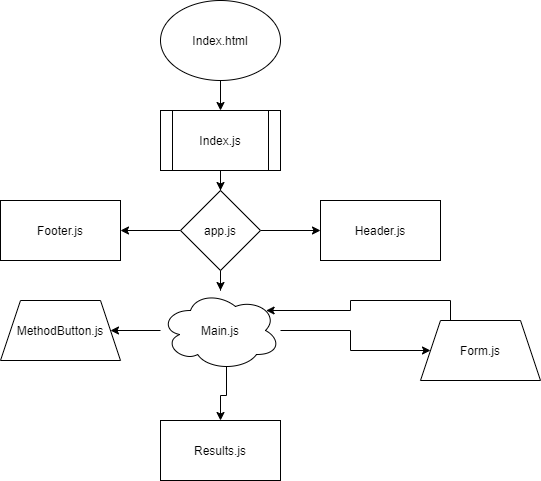

# RESTy 2

RESTy Phase 2: Connect RESTy with APIs, running live requests.
you can find the deployment [here](https://ibrahimbanat.github.io/RESTy-phase2/)

## Requirements

In phase 2, we will be connecting RESTy to live APIs, fetching and displaying remote data. Our primary focus will be to service GET requests

## Application Flow

- User enters an API URL
- Chooses a REST Method
- Clicks the “Go” button
- Application fetches data from the URL given, with the - method specified
- Displays the response headers and results separately
- Both headers and results should be “pretty printed” JSON

## Hierarchy

Suggested Component Hierarchy and Application Architecture:

- `index.js` - Entry Point
- `app.js` - Container

  - Holds state: Count and Results Array
  - A class method that can update state
  - Renders 2 Child Components

- `<Form />`

  - Expects a function to be sent to it as a prop
    Renders a URL entry form.
  - A selection of REST methods to choose from (“get” should be the default)
  - On submit
    - A selection of REST methods to choose from (“get” should be the default)

- `<Results />`

  - Expects the count, headers, results to be sent in as props
  - Renders the count
  - Renders the Result Headers as “pretty” JSON
  - Renders the Result Body as “pretty” JSON

## UML

